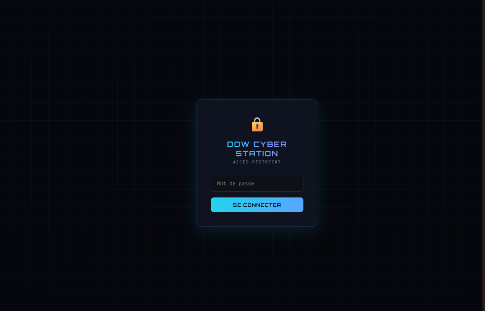
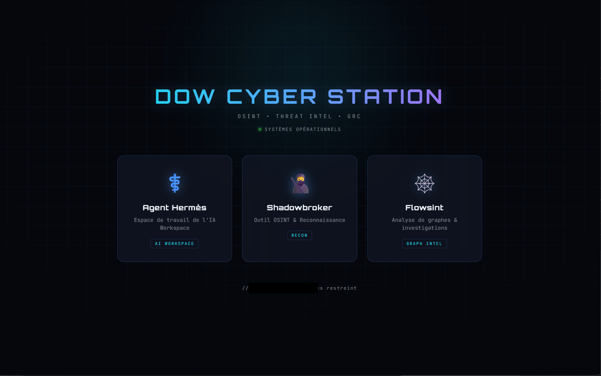
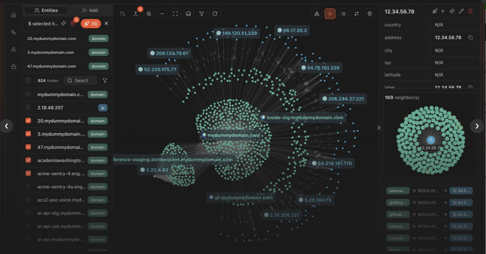
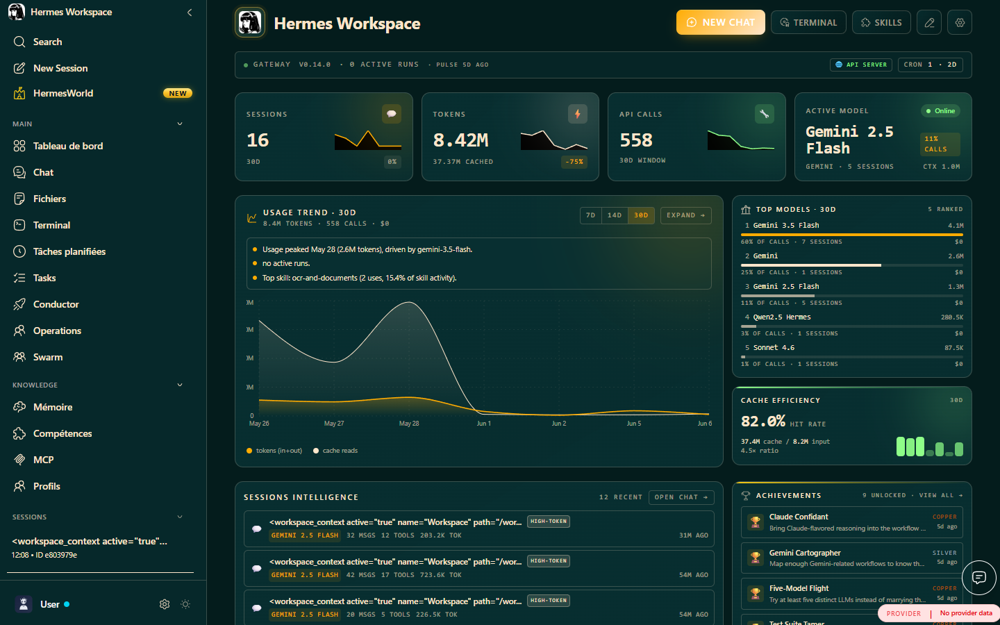
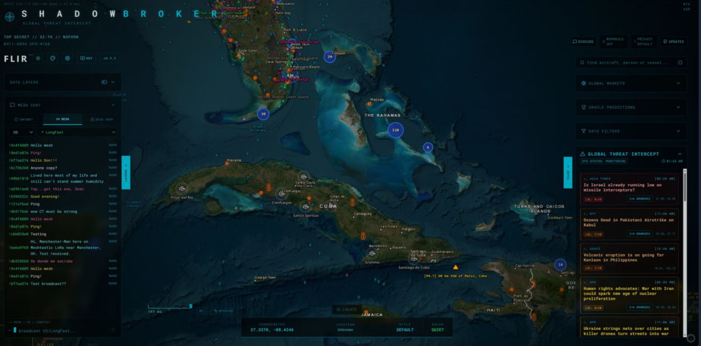
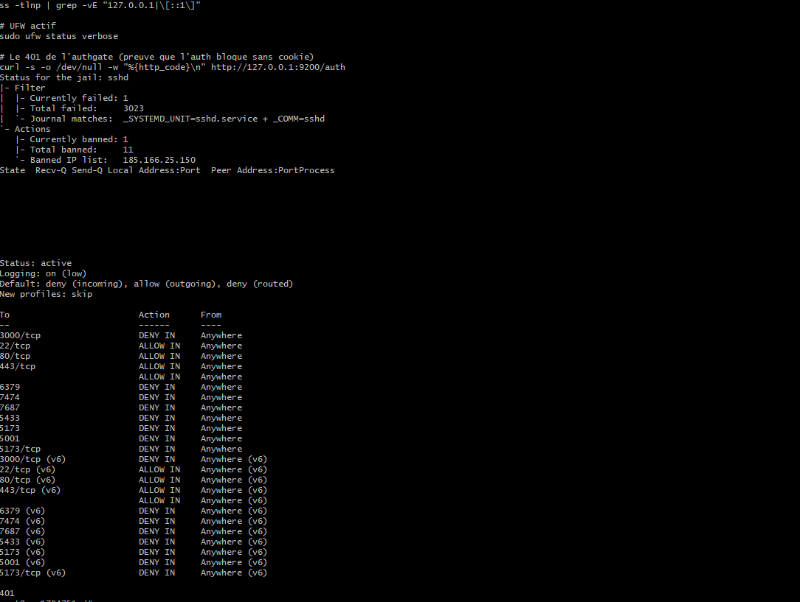

# Déploiement sécurisé d'une plateforme OSINT et agent IA auto-hébergée avec SSO

> **Projet personnel — Dorian Poncelet**
> Auto-hébergement, durcissement et authentification unifiée d'une station d'outils OSINT/Threat Intelligence sur VPS.

---

## Aperçu

| Portail de connexion (SSO maison) | Dashboard d'accès aux outils |
|:---:|:---:|
|  |  |
| *Page de login personnalisée — cookie de session signé, valable sur tous les sous-domaines* | *Portail unifié donnant accès aux 3 outils après authentification unique* |

**Les outils hébergés derrière le portail sécurisé :**

| Flowsint — Investigation par graphe |
|:---:|
|  |
| *Cartographie des relations entre entités via enrichisseurs OSINT automatisés (Neo4j)* |

| Hermès Workspace — Pilotage d'agents IA | Shadowbroker — Renseignement géospatial |
|:---:|:---:|
|  |  |
| *Supervision d'agents IA multi-modèles* | *Agrégation de 60+ flux OSINT temps réel sur carte* |

**Preuves de durcissement :**

| Fail2Ban, UFW & authentification |
|:---:|
|  |
| *Fail2Ban : 3023 tentatives d'intrusion SSH bloquées · UFW en `deny incoming` · ports internes refusés · service d'auth renvoyant 401 sans session valide. (Informations sensibles masquées.)* |

---

## 1. Contexte & objectif

Dans le cadre de ma reconversion en cybersécurité , j'ai mis en place une **station d'investigation OSINT** auto-hébergée sur un VPS, regroupant plusieurs outils derrière un portail unique sécurisé.

**Objectif :** disposer d'un accès distant simple et sécurisé à mes outils d'analyse (recherche d'entreprises, cartographie de relations, threat intel) tout en appliquant les bonnes pratiques de durcissement d'un serveur exposé sur internet.

**Cas d'usage métier :** analyse de surface d'exposition d'une entreprise, cartographie de décideurs, vérification de fuites de données — applicable à un contexte GRC (évaluation de risque tiers, due diligence).

---

## 2. Architecture

```
                    Internet
                       │
              ┌────────▼────────┐
              │   UFW Firewall   │  (80, 443, SSH custom)
              │   + Fail2Ban     │
              └────────┬────────┘
                       │
              ┌────────▼────────┐
              │      Nginx       │  Reverse proxy + TLS (Let's Encrypt)
              │  + auth_request  │
              └────────┬────────┘
                       │ vérifie chaque requête
              ┌────────▼────────┐
              │  AuthGate (Flask)│  Cookie de session signé HMAC
              │  127.0.0.1:9200  │  SSO sur *.domaine.tech
              └────────┬────────┘
                       │
        ┌──────────────┼──────────────┬───────────────┐
        ▼              ▼              ▼               ▼
   Portail HUB    Hermès            Shadowbroker     Flowsint
   (statique)     Workspace IA      OSINT géospatial OSINT graphe
                  127.0.0.1:3000    127.0.0.1:8080   127.0.0.1:5173
                                                    │
                                          ┌─────────┼─────────┐
                                          ▼         ▼         ▼
                                      PostgreSQL  Neo4j     Redis
                                      (graphe d'investigation)
```

**Principe clé :** tous les services applicatifs et bases de données écoutent **uniquement sur `127.0.0.1`**. Seul Nginx (ports 80/443) et SSH sont exposés. Aucun accès direct possible aux conteneurs depuis l'extérieur.

---

## 2bis. Les outils hébergés

La station regroupe trois applications complémentaires derrière le portail sécurisé :

### Hermès Workspace — *Poste de pilotage d'agents IA*
Interface unifiée de supervision d'agents IA (open source, MIT). Consolide en un seul lieu chat multi-modèles (Claude, GPT, Gemini, modèles locaux), mémoire persistante, bibliothèque de compétences, terminal intégré et orchestrateur de missions parallèles ("Conductor"). Stack : Node 22+, Python 3.11+, compatible Anthropic/OpenAI/Ollama.

### Shadowbroker — *Renseignement géospatial temps réel*
Plateforme OSINT (open source, AGPL-3.0) agrégeant 60+ flux de données publiques sur une interface cartographique : trafic aérien (OpenSky), maritime (AIS), satellites, événements géopolitiques (GDELT), imagerie Sentinel-2, caméras publiques. Stack : Next.js, MapLibre GL, FastAPI, Python.

### Flowsint — *Investigation par graphe*
Plateforme OSINT (open source, Apache-2.0) de cartographie de relations entre entités (domaines, IPs, emails, personnes, organisations) via 50+ enrichisseurs automatisés. Visualisation en graphe, moteur d'enrichissement asynchrone. Stack : FastAPI, Neo4j, PostgreSQL, Redis, Celery.

> Ces trois outils illustrent un spectre complet : **IA augmentée** (Hermès), **threat/geo-intelligence** (Shadowbroker) et **investigation relationnelle** (Flowsint).

---

## 3. Stack technique

| Couche | Technologie |
|--------|-------------|
| OS | Ubuntu 24.04 (VPS) |
| Reverse proxy / TLS | Nginx + Certbot (Let's Encrypt) |
| Conteneurisation | Docker / Docker Compose |
| Authentification | Service Flask custom (`auth_request` Nginx + cookie HMAC) |
| Pare-feu | UFW |
| Anti-brute-force | Fail2Ban |
| Application OSINT | Flowsint (FastAPI, Neo4j, PostgreSQL, Redis, Celery) |

---

## 4. Mesures de sécurité mises en œuvre

### 4.1 Durcissement de l'accès SSH
- **Fail2Ban** : jail SSH active, bannissement après 3 tentatives, IP personnelle en whitelist (`ignoreip`).
- Port SSH non-standard pour réduire le bruit des scanners automatisés.
- *Résultat observé : ~3000 tentatives d'intrusion bloquées sur 3 jours.*

### 4.2 Pare-feu (UFW)
- Politique par défaut : `deny incoming`.
- Ouverture explicite des seuls ports nécessaires (HTTP, HTTPS, SSH).

### 4.3 Isolation des services Docker
- **Problème identifié :** Docker contourne UFW en écrivant directement ses règles iptables — un `ufw deny` sur un port publié par Docker est inopérant.
- **Correction :** binding explicite de tous les ports conteneurs sur `127.0.0.1` dans les `docker-compose.yml` (ex. `"127.0.0.1:5173:8080"`), rendant les bases de données (Redis, Neo4j, PostgreSQL) inaccessibles depuis l'extérieur.

### 4.4 Chiffrement en transit
- Certificats TLS Let's Encrypt sur tous les sous-domaines, renouvellement automatique.
- Redirection systématique HTTP → HTTPS.
- En-têtes de sécurité (`X-Frame-Options`, `X-Content-Type-Options`, `Referrer-Policy`, etc.).

### 4.5 Authentification unifiée (SSO maison)
- Remplacement de l'authentification HTTP Basic (popup navigateur, identifiants en clair) par un **portail de connexion personnalisé**.
- Service d'authentification léger en Flask :
  - Vérification du mot de passe **côté serveur** (comparaison à temps constant `hmac.compare_digest`).
  - Cookie de session **signé HMAC** (librairie `itsdangerous`), `HttpOnly`, `Secure`, `SameSite=Lax`, expiration 12h.
  - Cookie scoped sur `*.domaine.tech` → **authentification unique** pour l'ensemble des outils.
- Intégration via le module `auth_request` de Nginx : chaque requête est validée par sous-requête interne avant d'atteindre l'application.

---

## 5. Problèmes rencontrés & résolution (démarche d'analyse)

| Problème | Diagnostic | Solution |
|----------|-----------|----------|
| Conteneur Neo4j en échec au démarrage | Logs : `unauthorized` répétés — ancien volume avec mot de passe différent | Suppression des volumes (`down -v`) et redéploiement |
| Enrichisseur OSINT sans résultat | Logs applicatifs : message `HIBP_API_KEY` requis | Identification d'un enrichisseur nécessitant une clé API payante vs. gratuits |
| `ufw deny` sans effet sur un port Docker | Connaissance du contournement iptables par Docker | Binding sur `127.0.0.1` au niveau du compose |
| Popup d'auth récurrente sur une SPA | Appels API/WebSocket multiples incompatibles avec Basic Auth | Migration vers cookie de session + `auth_request` |

> Cette section illustre la **méthode** : lecture des logs (`docker logs`), formulation d'hypothèses, validation par test, correction à la racine.

---

## 6. Compétences démontrées

- **Administration système Linux** : services systemd, gestion de logs, utilisateurs.
- **Sécurité réseau** : pare-feu, segmentation, principe du moindre privilège, réduction de la surface d'attaque.
- **Conteneurisation** : Docker, Docker Compose, isolation réseau, gestion des volumes et secrets.
- **Reverse proxy & TLS** : Nginx, certificats, en-têtes de sécurité, `auth_request`.
- **Authentification** : conception d'un mécanisme de session sécurisé (signature HMAC, attributs de cookie).
- **OSINT / Threat Intelligence** : déploiement et exploitation d'une plateforme d'investigation par graphe.
- **Démarche analytique** : diagnostic par les logs, résolution méthodique d'incidents.

---

## 7. Pistes d'amélioration (axe d'apprentissage continu)

- Migration de l'auth maison vers une solution éprouvée (**Authelia / Authentik**) avec **2FA** et gestion multi-comptes.
- Ajout d'une **journalisation centralisée** des accès (SIEM léger, ex. Wazuh) — pertinent pour un profil SOC/GRC.
- Mise en place de **sauvegardes automatisées** des volumes Docker.
- Audit de configuration via **Lynis** et scan de vulnérabilités.

---

## 8. Note éthique

Les outils OSINT déployés sont utilisés exclusivement sur des **données publiques** dans un cadre légal (reconnaissance passive). Le scan actif d'infrastructures tierces n'est pas pratiqué sans autorisation.

---

*Projet réalisé en autodidacte dans le cadre d'une reconversion professionnelle vers la cybersécurité (cible GRC / SOAR).*
